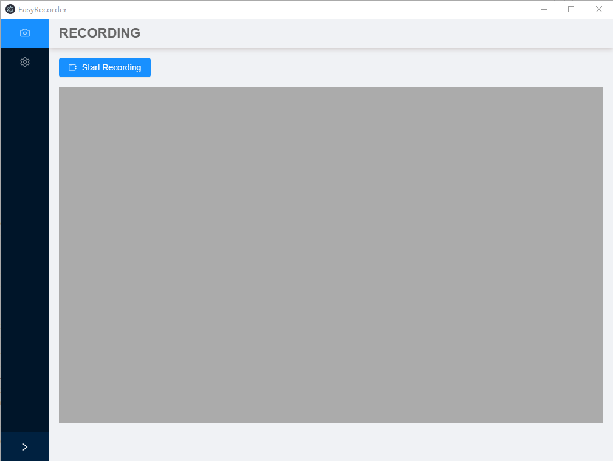
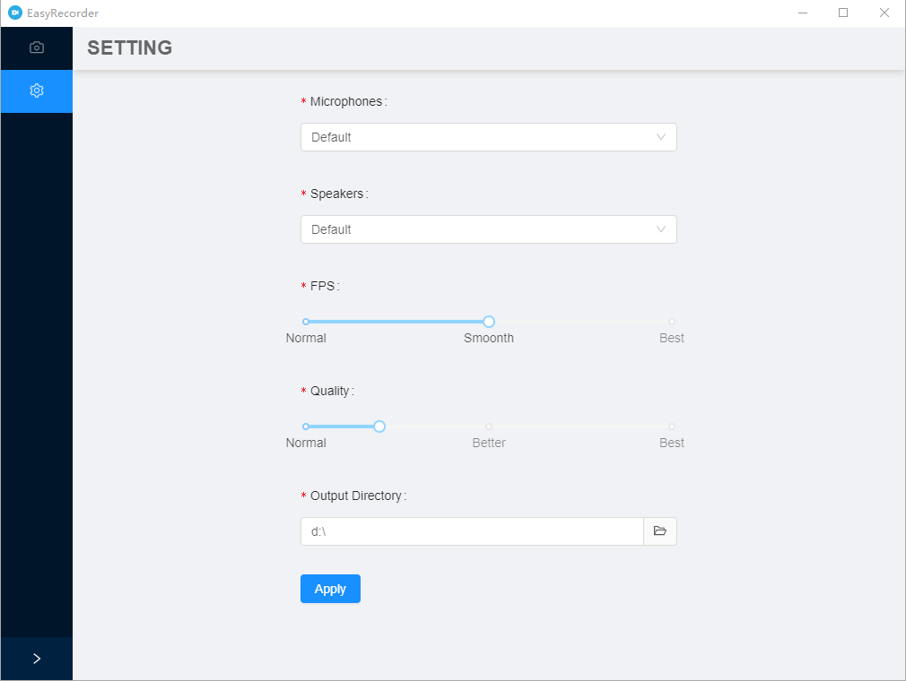

# EasyRecorder

<br>

<p>
  EasyRecorder is a cross-platform screen recorder which is written by node-js and depended on ffmpeg-recorder.
</p>

<br>

## ScreenShots





## Features

<br>

- Different ways to record screen 、speaker and microphone
- Encode screen data from rgb to h264
- Encode audio data from pcm to aac
- Mux h264 and aac to a single mp4 file
- Only support in windows for now(at least win7)
- Image preview(yuv420)
- Record only mic or speaker,or only video without any audio

<br>

## Todo

<br>

- More muxers such as .mkv
- Screen grabber for mac and linux systems
- Audio grabber for mac and linux systems

<br>

## Usage

<br>

### Install depends

```sh

$ yarn

```

### Run in dev

```sh

$ yarn dev

```

### Package

```sh

$ yarn package

```
